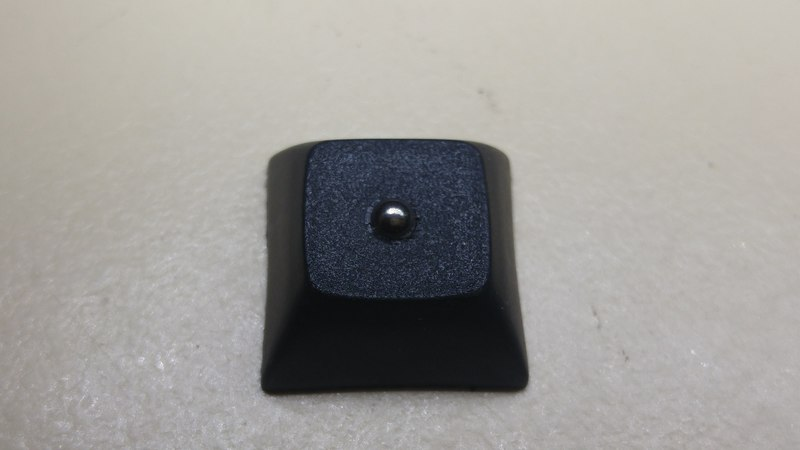

# Some background
I bought an [Ergo Dox Infinity](https://input.club/devices/infinity-ergodox/)
keyboard a few years ago and, on a side note, I freakin' love it! It came with a
full blank set of keycaps, which makes total sense for programmable keyboard. Up
until recently I've been using keycaps that I stole from another keyboard I have
but those had to go home so I could sell that keyboard. That left me without
homing bumps on my F and J keys (no, I haven't made the jump to Dvorak yet) and
I just can't deal with that.

I found a [great photo tutorial](https://imgur.com/gallery/qMgWr) of putting a
ball bearing into a keycap. chimponabike, the author, uses a mill/or CNC machine
to make the magic happen but I don't have one of those.

It turns out it's not that hard to do with a free hand drill so I thought I'd
document how I did it. Sorry for the terrible photos, I don't have a good
excuse. They just suck.

# Let's do it
First up, here's the tools I used.



 1. a drill (with a chuck that holds tiny drill bits)
 1. a knife
 1. a 1/8 inch drill bit, same size at the ball bearing
 1. a 1.5mm drill bit
 1. a ball bearing
 1. a keycap, I'm using Cherry MX caps

I found that the ball bearings from the pedals on a bicycle are a great size plus they should be easy to find; just be on the lookout for someone dumping an old bike. If you get ball bearings from somewhere else, just make sure the larger drill bit is the same size or a touch smaller than the bearing diameter.

Grab your smaller drill bit and drill from the bottom of the keycap. A 1.5mm drill bit should self centre inside the cherry MX stem, which makes it super easy to get a nice looking final product. An off centre ball bearing would drive you mad. Drill all the way through the keycap from the bottom. This hole is so you can remove the bearing later on.

  

Now flip the cap over and change to the larger drill bit. The drill bit will self centre in the hole we drilled from the bottom. **Don't drill all the way through!** We only want to drill just deep enough that the ball bearing will sit in the cap, which is just over half the diameter of the ball bearing. If in doubt, start with drilling less and you can always drill more.

  

The drilling from the top will most likely leave some crusty bits of plastic around the hole so grab your knife and cut them off.

...so it ends up nice and clean.

It's time to add the ball bearing. Sit your ball bearing on top of the hole in the keycap.

Lastly, press the bearing into the keycap using something hard. I used the side of a kitchen knife handle. Whoops, I should've put that in the list of tools needed. Once again, start with pressing it in less, give it a feel and if it's sticking out too much, you can press it in further. We have the hole in the bottom so you can always press the bearing back out but you probably don't want to do that too often otherwise the bearing might not press fit into the hole tightly.

We're done. You've got yourself some good looking keycaps with decent homing bumps. I have to say, I prefer strong homing bumps. You can always adjust the bearings' depth to your preference. I find pressing it in just over half way feels nice to me and I think it looks great because it completely fills the hole.

Hope this helps. Let me know how you go.

Tom
