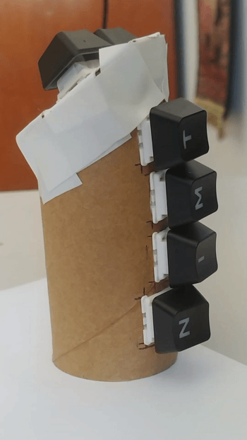
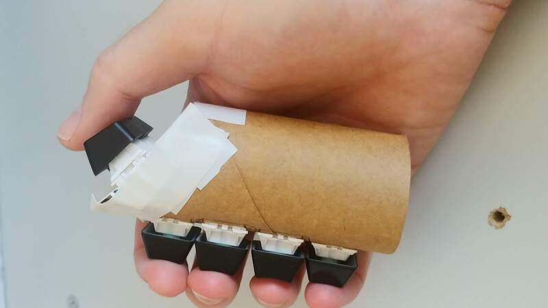
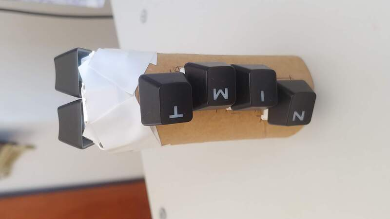
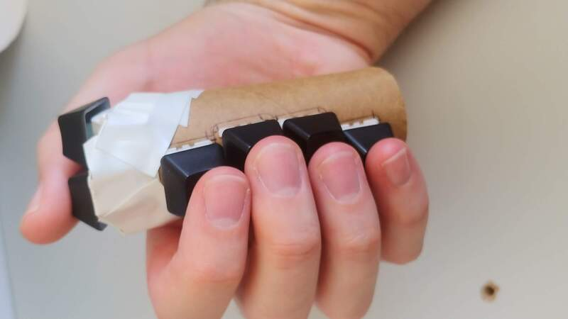
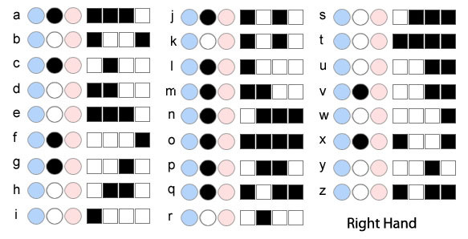
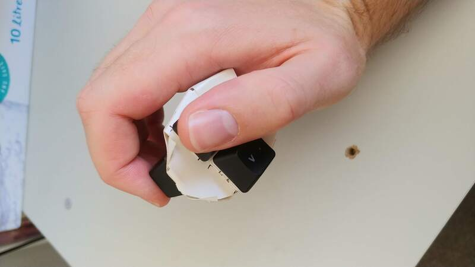

TL;DR: Here's a non-functioning concept of a handheld chorded keyboard.

Recently I've been interested in chorded keyboards. Well, interested might be an
understatement, it's more like consumed. I tried a
[TapStrap](https://www.tapwithus.com/) v1, which unfortunately didn't live up to
my expectations. The main problem was the thing everyone fears about this
product, the accuracy of recognising the taps.  This led me to look at other
options that use physical keys like the [BAT
Keyboard](https://www.infogrip.com/bat-keyboard.html) or the wonderful things
the [maker community comes up with](https://hackaday.com/tag/chorded-keyboard/).

I like the feature of the TapStrap where you don't need a table to use it.
Any surface should be suitable. In my experience, that's not how it works in
reality, but I love the concept.

I have a [BlueMicro 4x4
macropad](https://store.jpconstantineau.com/#/item/4x4macropad) on the way and
as I already have a QMK based keyboard, I don't need another keyboard or
a macropad. Why order it you ask? N+1 keyboards is why :grin:. Being Bluetooth
gives me hope it'll make a good base for a wireless chorded keyboard, just like
what we're talking about here.

These are the requirements I have for a chorded keyboard:

- uses mechanical keyboard switches
- handheld, or at least usable on more surfaces than just a regular desk
- enough keys to be able to achieve the alphabet, numbers, some symbols and the
    other essentials like space, enter, arrows, backspace, etc.
- ideally cordless
- hackable and open source

You've already seen it at the top of this post because everybody knows if you
don't start a blog post with an image, even an unrelated one, then nobody will
hang around for the words. I'll just pretend you haven't already seen it, so...
Introducing a concept to satisfy the requirements. We're sparing no expense and
making it from a toilet paper roll:

A cylinder doesn't feel like exactly the right shape, but it's close enough.
This key layout lets your hand sit in essentially the static, relaxed position
so it feels pretty good.

I'd like to get a third key under the thumb. From my other experiments with
keyboards, I've found that having three thumb keys side-by-side is a bit too
much for me. Instead, I've found I quite like having a low profile switch (Kailh
Choc style) in front of a full height switch (Cherry MX style).  I'm fairly
confident I can make it work, but it'll need testing to confirm.

I've gone with a slight columnar stagger for the finger keys. I'm a believer
that fingers of different lengths are happy with staggered keys. Ignore the
letters on the keys, they're just what I had lying around. I think I'll try to
stand on the shoulders of giants and try out the mapping that the [BAT
Keyboard](https://www.infogrip.com/bat-keyboard.html) uses:

...or, as [/u/qpockets pointed
out](https://www.reddit.com/r/MechanicalKeyboards/comments/khgurd/prototyping_a_key_layout_for_a_handheld_chorded/ghb5nde?utm_source=share&utm_medium=web2x&context=3)
the [artsey.io layout](https://www.artsey.io/_FILES/ARTSEY.jpg) is gaining
momentum. I'm keen to try the artsey layout but at this point I feel like having
a strap to hold the 'board to your hand so you can use the thumb for a few extra
keys will be a winning strategy.

I'm right handed so I've been making it to suit, but I've found that if you turn
it upside down, it will fit the left hand because the stagger of the finger keys
goes the other way. Yes, the thumb keys are at the wrong end but if the thumb
keys were mirrored at both ends, it should work as an ambidextrous keyboard.

The toilet paper roll is not up to any kind of serious use so the next version
will probably be made from a plastic drink bottle. More rigidity but still easy
to cut up with a knife.
