This is a guide on how to swap the bearings in your Elecom Deft Pro trackball.
The ruby ones that come from the factory aren't great because they make small
movements difficult due to sticking.

You should absolutely read [this popular guide](https://imgur.com/a/XzUOey1) too
from
[/u/KgOfHedgehogs](https://www.reddit.com/r/Trackballs/comments/8st8ud/i_made_first_elecom_deft_pro_disassembly_guide/).
You should also watch this [excellent
video](https://www.youtube.com/watch?v=Hgst7JaiAa4) about doing the same process
for the Elecom Huge. This guide is really just adapting that to the Deft Pro.
Note: all the red lines are drawn with the trackball, so that's why they look so
horrible.

Thingies used:
- [ZrO2 ceramic bearings](https://amzn.to/3hcL0fE)
- [toolkit](https://amzn.to/35VocvO) to get the Torx T6 and phillips PZ00 bits needed
    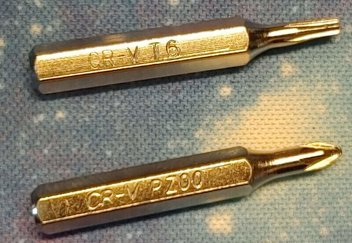
- masking tape, but any tape will be fine. Maybe even [Blu-Tack](https://amzn.to/3wV6qVo)

# Summary
The ball bearings are in the trackball cup. This cup is made in two halves that
are held together by 3 screws. You need to disassemble the device enough to be
able to undo those screws and replace the bearings.

# Brief steps
1. remove screws
1. lift thumb cluster out
1. unclip trackball cup
1. unscrew the laser PCB
1. put tape over the balls
1. unscrew the cup
1. replace balls
1. follow steps in reverse to assemble

# Detailed steps

## Remove the trackball
Same as usualy, flip it upside down and push through the hole on the bottom.

## Remove the 7 screws on the bottom
These screws are Torx T6, which comes in the kit I linked above. They're all the
same, so you don't have to worry about mixing them up. You'll have to peel off
the rubber pads to access most of them. The pads stick back on after, so you
don't have to buy new pads. For the one screw that's under the label, just feel
for it and punch through the sticker. You can place the screws on a piece of
tape to stop them from getting lost if that helps you.

The [linked imgur guide](https://imgur.com/uLHXs4b) nicely shows all the screws.

You can see five of the screws here:
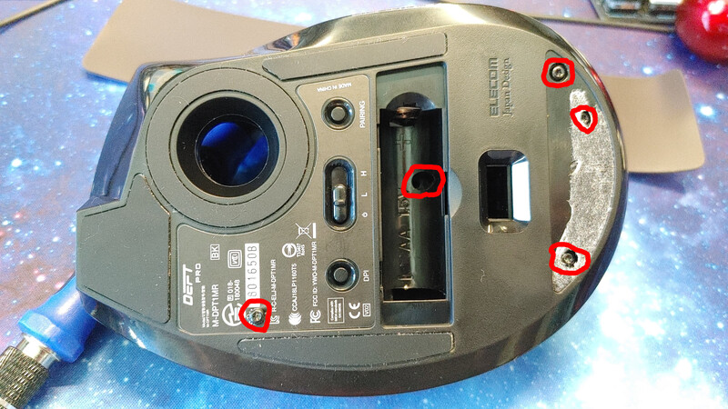

The screw under the left pad is inline with the centre of the battery, unpeel it
from the bottom:
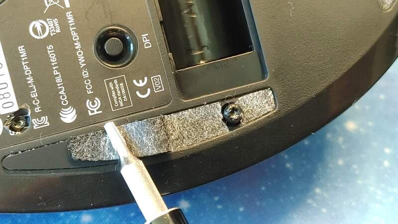

The screw under the right pad is in the middle of that pad, so unpeel from
either end:
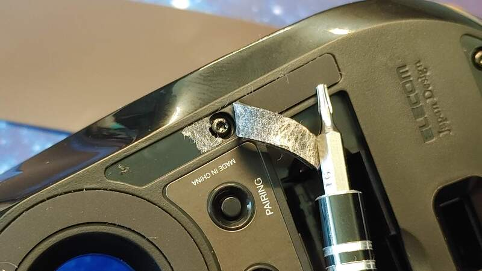

The screw under the label. Just feel for it and punch through. No need to remove
the label:
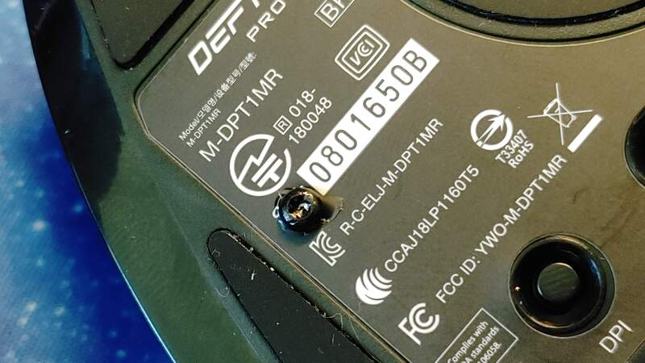

## Remove the top cover of the trackball
With all the screws out, the top cover will lift off. Start by opening at the
back of the device, it won't take much effort to open. If it's hard to open,
make sure you're removed *7* screws.

There are no wires going to the top cover of the device, so you can lift it
without fear of tearing a connection out. The front of the cover is held by two
tabs. You get the cover off by lifting and jiggling it.

## Remove the thumb button cluster
> There is a cable attached. You don't have to undo it, but don't rip it out.

This is just sitting there. It was held in by a screw, but you removed that so
you can just lift it up. You have to remove it to make it easier to remove the
trackball cup. There *is* a cable going to the thumb cluster. You do *not* have
to unplug the cable, just be careful not to tear it out when you're working.

## Remove the trackball cup
> There is a cable attached. You don't have to undo it, but don't rip it out.

The screws that hold the trackball cup together are removed from the bottom, so
you have to remove the cup, which is what we're doing in this step. It's held
down by three tab clip thingies.

I undid the left side clips first and once they were clear of the tabs, I only
had to press a tiny amount on the right side to release it. I found it a bit
tricky to get the front-left tab, and seeing as nobody else has complained about
this, I probably did it the wrong way. I did try releasing the right side and
lifting it, but it didn't go. Perhaps I should've tried harder. For me, **this
was the most frustrating step**. Make sure you don't rip the cable out when you
remove the cup.

The single tab on the right:
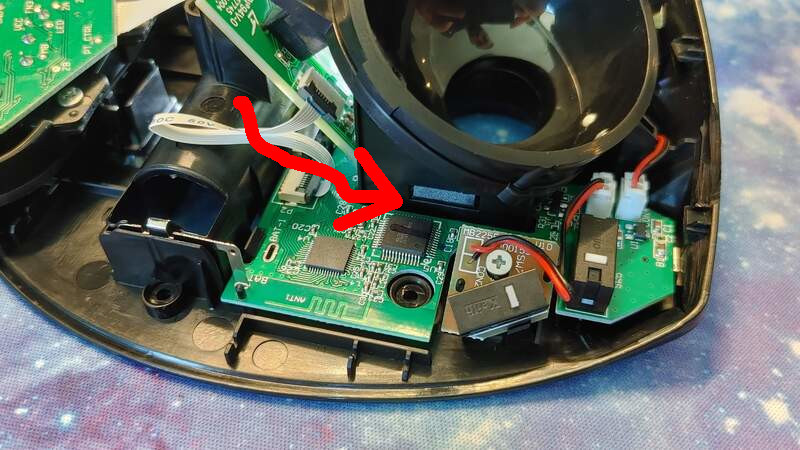

The two tabs on the left:
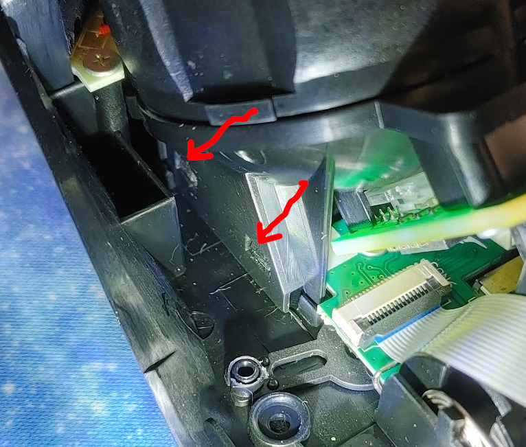

I ended up using one side of a pair of tweezers to hold the front-left tab tab
open, then it was easy to press the other clips with a screwdriver and pop the
cup off:
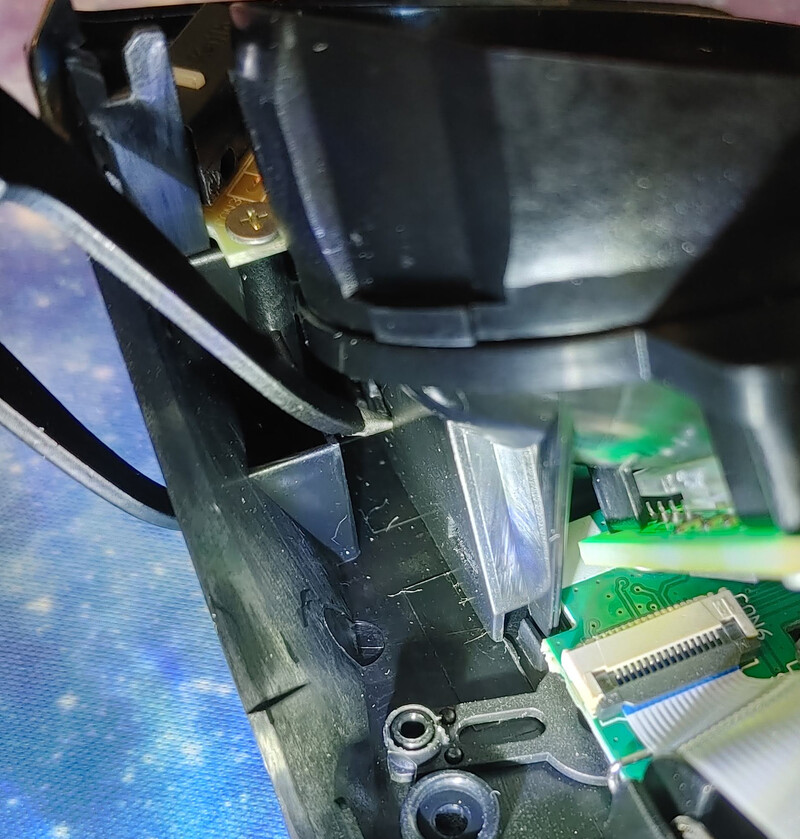

## Unscrew the laser/sensor PCB
There is one screw for the cup under this PCB so we have to remove it. There are
two screws on the PCB that I used a phillips PZ00 bit on. The plastic lens for
the laser is just sandwiched in place so pay attention to which way it comes
out.

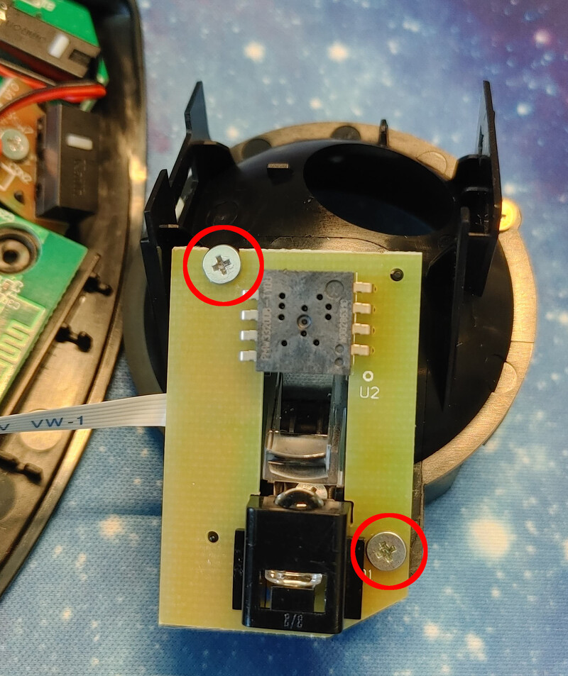

Cup removed without disconnecting any cables:
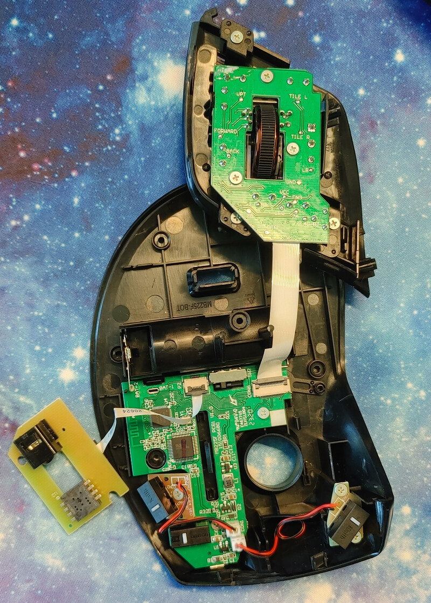

## Tape the bearings
Once you undo the two halves of the cup, the bearings will fall out. If you
don't control them, they'll bounce like crazy and you'll never see them again.
To control them, tear off three pieces of tape and place one over each ball.

## Separate the cup halves
There are three screws holding the trackball cup together. Undo them (I used the
same phillips PZ00 bit). The halves have locating pins so you'll have to gently
pry them apart with something thin. Be careful that the balls stay stuck to the
tape while doing this.

You *don't* have to fully separate the halves, although you might find that
easier. You only have to get them far enough apart that you can swap the balls
out.

The three screws:
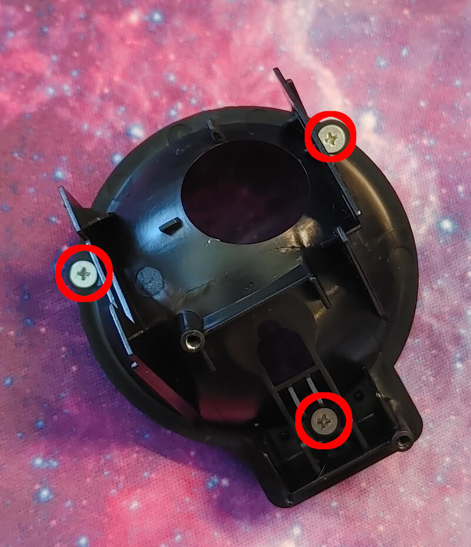

## Swap the balls
This is what we're here for. Get your new ball bearings and swap them in. Use
pieces of tape to make them easier to handle. You can use another piece of tape
to stop the spares from rolling around on the desk:

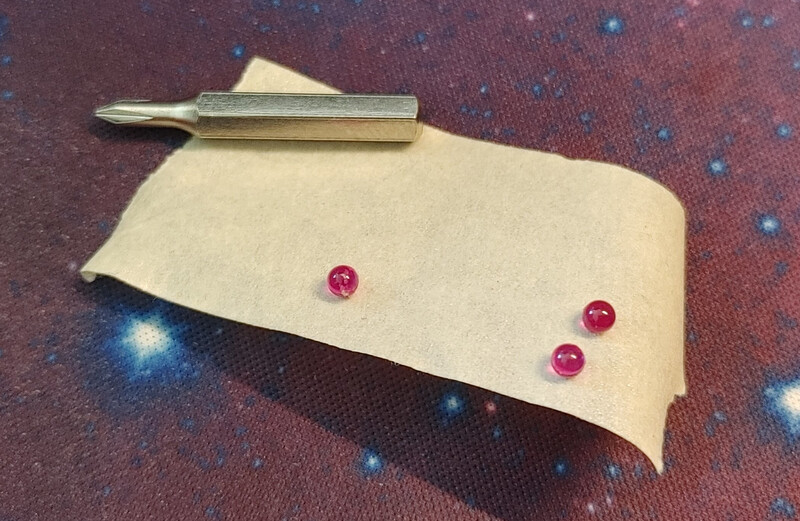

## Screw the cup back together
As you do this, make sure
1. you don't get tape caught between the halves
1. the balls stay in place
1. you pay attention to the two small locating pins between the halves. There is
   only *one* correct way to assemble the halves.

## Put everything back together
Just follow all the steps in reverse:
1. screw the laser/sensor PCB back on, making sure the plastic lens is
   sandwiched between the PCB and cup
1. clip the cup back on
1. place the thumb cluster in place
1. put the top cover back on, starting with the two clips at the front then
   closing the back
1. put all 7 screws back in
1. stick the pads back on
1. if you have some alcohol spray, clean the ball bearings in case they have
   sticky residue from the tape
1. put the ball back in
