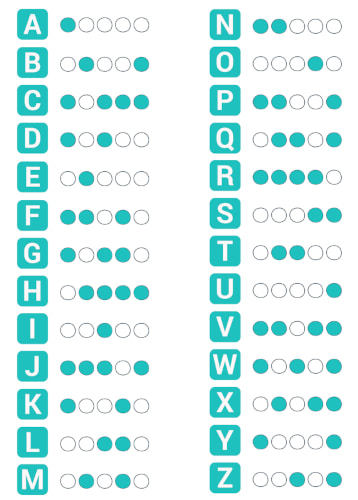
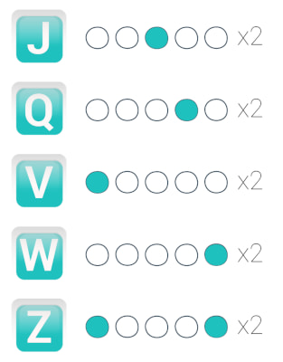
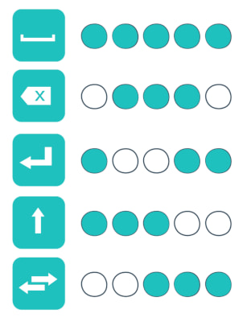
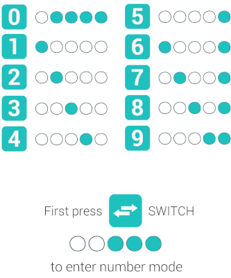
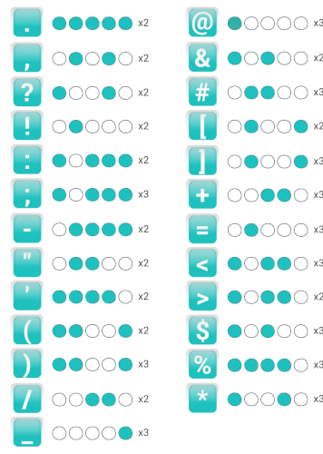

The [TapStrap](https://www.tapwithus.com/) is an interesting keyboard. It's also
not that cheap so it's understandable if you're apprehensive about buying it.

I wanted to try the layout without buying the keyboard to see how it works for
me. The first step is to find out what the layout is and my Google-fu let me
down because I couldn't find anything written. All the references tell you to
use the TapGenius app (*the app* from here on).

So here I've transcribed the layout from *the app* as a reference.

I'm going to set these up as
[combos](https://docs.qmk.fm/#/feature_combo?id=combos) in my QMK powered
keyboard to try them out.

# How to read this
All the combinations are assuming you're using your right hand. The `*` means
tap that key/finger and `_` means don't tap.

# Alphas
First, here's a screenshot from *the app*.



Here's a textual version that uses the same headings that *the app* uses when it
teaches you.

## AEIOU - One finger

```
 A: * _ _ _ _
 E: _ * _ _ _
 I: _ _ * _ _
 O: _ _ _ * _
 U: _ _ _ _ *
```

## NTLS - Two fingers together

```
 N: * * _ _ _
 T: _ * * _ _
 L: _ _ * * _
 S: _ _ _ * *
```

## DMZ - Two fingers skipping one

```
 D: * _ * _ _
 M: _ * _ * _
 Z: _ _ * _ *
```

## KB - Two fingers skipping two

```
 K: * _ _ * _
 B: _ * _ _ *
```

## HCVJR - One finger up (four finger taps)

```
 H: _ * * * *
 C: * _ * * *
 V: * * _ * *
 J: * * * _ *
 R: * * * * _
```

## YW - Looks like they letters

```
 Y: * _ _ _ *
 W: * _ * _ *
```

## GX - One finger chasing two

```
 G: * _ * * _
 W: _ * _ * *
```

## FQ - Two fingers chasing one

```
 F: * * _ * _
 Q: _ * * _ *
```

## P Return - Three fingers skipping two

```
   P: * * _ _ *
 Ret: * _ _ * *
```

# Shortcuts
Then there are some double tap shortcuts for some of the keys.



```
 J: _ _ * _ _ x2
 Q: _ _ * _ _ x2
 V: * _ _ _ _ x2
 W: _ _ _ _ * x2
 Z: * _ _ _ * x2
```

# Essentials
Here are those other keys you need to actually type useful things.



## Shift Del Switch - Three fingers together

```
 Shift: * * * _ _
  Bksp: _ * * * _
Switch: _ _ * * *
```

## Return - Three fingers skipping two
Yeah, repeated from above as return belongs in this category.

```
 Return: * _ _ * *
```

## Space - everything!
```
 Space: * * * * *
```

# Numbers



As a refresher, here's the switch combo:
```
Switch: _ _ * * *
```

Now, the numbers:
```
 0: _ * * * *
 1: * _ _ _ _
 2: _ * _ _ _
 3: _ _ * _ _
 4: _ _ _ * _
 5: _ _ _ _ *
 6: * _ _ _ *
 7: _ * _ _ *
 8: _ _ * _ *
 9: _ _ _ * *
```

# Symbols


